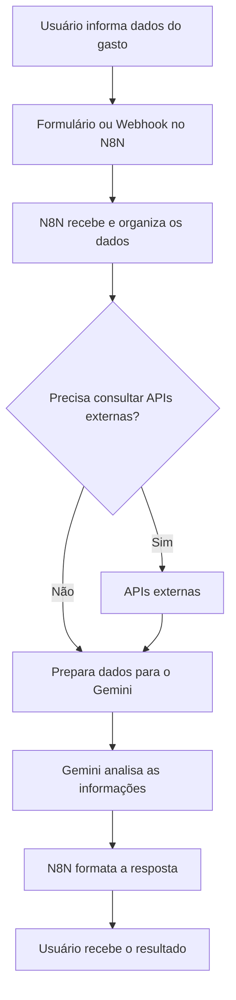

# Assistente Financeiro

## Sobre o Projeto

**Projeto:** Assistente Financeiro

**Problema que resolve:** Ajuda usuários a registrar, organizar e entender seus gastos pessoais de forma simples.

## Integrantes

| Nome | GitHub |
|------|--------|
| Izabelle Vitoria | @izabellevitorias |
| Julia Baxega dos Reis | @juliabxreis |
| Guilherme Paulino dos Santos Alves | @guipaulino0202 |

## Como funciona

O usuário informa dados sobre seus gastos, como valor, categoria, descrição ou data da despesa. O fluxo criado no N8N recebe essas informações, organiza os dados e pode consultar APIs externas para complementar o processamento. Em seguida, as informações são enviadas para o Gemini, que interpreta os dados e ajuda a gerar uma resposta mais clara para o usuário. Como saída, o usuário recebe uma resposta organizada, podendo visualizar o registro do gasto, alertas, classificações ou um resumo financeiro simples.

## Arquitetura

