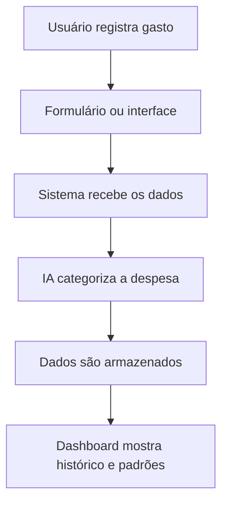

# [ASSISTENTE FINANCEIRO]
## Sobre o Projeto

**Projeto:** [Assistente Financeiro]

**Problema que resolve:** [Ajuda usuários a registrar, organizar e entender seus gastos pessoais de forma simples.]
## Integrantes
| Nome | GitHub |
|------|--------|
| [Izabelle Vitoria] | [@izabellevitorias] |
| [Julia Baxega dos Reis] | [@juliabxreis] |
| [Guilherme Paulino dos Santos Alves] | [@guipaulino0202] |

## Arquitetura

